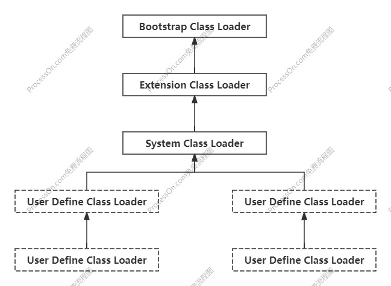
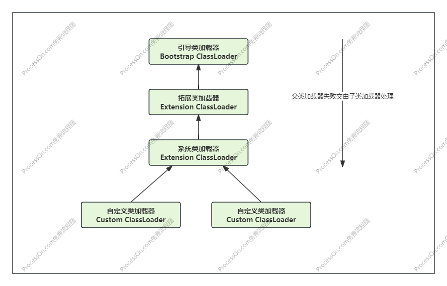
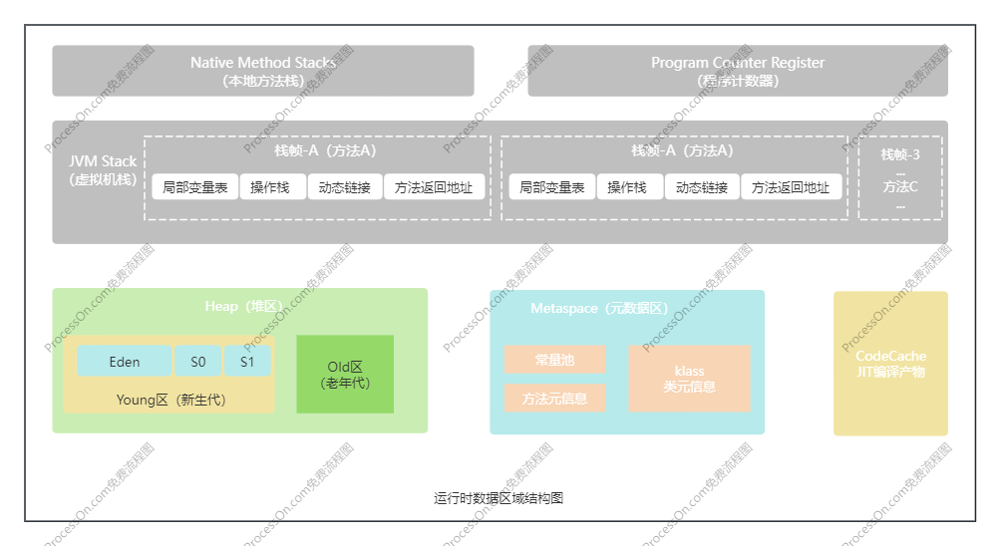

# 1 JVM介绍

## 1.1JVM 整体结构


## 1.2jvm的架构模型

Java编译器输入的指令流基本上是一种基于栈的指令集架构，另一种指令集架构则是基于寄存器的指令集架构。

基于栈式架构的特点：

1. 设计和实现更简单，适用于资源受限的系统；

2. 避开了寄存器的分配难题：使用零地址指令方式分配；

3. 指令流中的指令大部分是零地址指令，其执行过程依赖于操作栈。指令集更小，编译器容易实现

4. 不需要硬件支持，可移植性更好，更好实现跨平台

基于寄存器架构的特点：

1. 典型的应用是x86的二进制指令集：比如传统的PC一级Android的Davlik虚拟机。

2. 指令集架构完全依赖硬件，可移植性差

3. 性能优秀和更高的执行效率

4. 花费更少的指令去完成一项操作。

5. 在大部分情况下，基于寄存器架构的指令往往都以一地址指令、二地址指令和三地址指令为主，而基于栈式
   架构的指令集确是以零地址指令为主

# 2 类加载器子系统

## 2.1类加载过程


### 2.1.1加载阶段（加载字节码文件）

1. 通过一个类的全限定名获取定义此类的二进制字节流。

2. 将这个字节流所代表的的静态存储结构转化为方法区的运行时数据结构。

3. 在内存中生成一个代表这个类的java.lang.Class对象，作为方法区中这个类的各种数据的访问入口。

JVM规范中并没有规定字节码文件从何处加载

### 2.1.2链接阶段

链接阶段分为三个步骤：验证、准备、解析

#### 2.1.2.1验证（Verify）

1. 目的在于确保Class文件的字节流中包含信息符合当前虚拟机要求，保证被加载类的正确性,不会危害虚拟机自身安全.

2. 主要包括四种验证：文件格式验证，元数据验证，字节码验证，符号引用验证 。

#### 2.1.2.2准备（Prepare）

1. 为类变量分配内存并且设置该类变量的默认初始值，即零值

2. 这里不包含用final修饰的static，因为final在编译的时候就会分配了，准备阶段会显式初始化。

3. 这里不会为实例变量分配初始化，类变量会分配在方法区中，而实例变量是会随着对象一起分配到Java堆中。

#### 2.1.2.3解析（Resolve）

1. 将常量池内的符号引用转换为直接引用的过程。

2. 事实上，解析操作往往会伴随着JVM在执行完初始化之后再执行。

3. 符号引用就是一组符号来描述所引用的目标。符号引用的字面量形式明确定义在《java虚拟机规范》的Class文件格式中。直接引用就是直接指向目标的指针、相对偏移量或一个间接定位到目标的句柄。

4. 解析动作主要针对类或接口、字段、类方法、接口方法、方法类型等。对应常量池中CONSTANT_Class_info、CONSTANT_Fieldref_info、CONSTANT_Methodref_info等。

### 2.1.3初始化（Initialization）

1. 初始化阶段就是执行类构造器方法\<clinit\>()的过程。

2. 此方法不需定义，是javac编译器自动收集类中的所有类变量的赋值动作和静态代码块中的语句合并而来。

3. 构造器方法中指令按语句在源文件中出现的顺序执行。

4. \<clinit\>()不同于类的构造器。(关联:构造器是虚拟机视角下的\<init\>())若该类具有父类，JVM会保证子类的\<clinit\>()
   执行前，父类的\<clinit\>()已经执行完毕。

5. 虚拟机必须保证一个类的\<clinit\>()方法在多线程下被同步加锁。

在下面这段代码中，main方法会输出311，验证了第三点，而在静态代码块中可以使用j，是因为在链接的准备阶段会为类变量设置默认的初始值，这时候j已经存在了，所以可以使用。
但是，在static代码块中不可以使用j。

```java
public class ClassInit {
    private static int i = 1;

    static {
        i = 2;
        j = 3;
    }

    private static int j = 311;

    public static void main(String[] args) {
        System.out.println(j);//311
    }
}
```

在类中，如果没有定义静态变量或者静态代码块，在类初始化的时候就没有clinit方法，但是init方法一定有

## 2.2 类加载器的分类

JVM支持两种类型的类加载器，分别为引导类加载器（BootstrapClassLoader）和自定义类加载器（UserDefineClassLoader）。
从概念上来讲，自定义类加载器一般指的是程序中有开发人员自定义的一类加载器，但是Java虚拟机规范没有这么定义，而是将所有派生于抽象类ClassLoader的类加载器都划分为自定义类加载器。

无论类加载器的类型如何划分，在程序中我们最常见的类加载只有3个：

这四者之间是包含关系，不是上下层，也不是父子类的继承关系。

### 2.2.1 虚拟机自带的类加载器

#### 2.2.1.1 启动类加载器（引导类加载器，Bootstrap ClassLoader）

1. 这个类加载器使用C/C++语言实现的，嵌套在JVM内部
2. 它用来加载Java的核心类库（JAVA_HOME/jre/lib/rt.jar、resources.jar或sum.boot.class.path路径下的内容），用于提供JVM自身需要的类
3. 并不继承子java.lang.ClassLoader，没有父加载器
4. 加载拓展类和应用程序类加载器，并指定他们的父类加载器
5. 处于安全考虑，Bootstrap启动类加载器只加载包名为java、javax、sun等开头的类

#### 2.2.1.2 扩展类加载器（Extension ClassLoader）

1. Java语言编写，由sun.misc.Launcher$ExtClassLoader实现
2. 派生于ClassLoader类
3. 父类加载器为启动类加载器
4. 从java.ext.dirs系统属性所指定的目录中加载类库，或从JDK的安装目录的jre/lib/ext子目录（拓展目录）下加载类库。如果用户创建的JAR放在此目录下，也会自动由拓展类加载器加载

#### 2.2.1.3 应用程序类加载器（Application ClassLoader）

1. Java语言编写，由sun.misc.Launcher$AppClassLoader实现
2. 派生于ClassLoader类
3. 父类加载器为拓展类加载器
4. 它负责加载环境变量classpath（用户自定义的类）或系统属性java.class.path指定路径下的类库
5. 该类加载器是程序中默认的类加载器，一般来说，java应用的类都是由它来完成加载
6. 通过ClassLoader#getSystemClassLoader()方法可以获取到该类加载器

#### 2.2.1.4 用户自定义类加载器

为什么要自定义类加载器：

1. 隔离加载类
2. 修改类加载方式
3. 拓展加载源
4. 防止源码泄露

- 用户自定义类加载器实现步骤：

1. 可以通过基础抽象类java.lang.ClassLoader类的方式，实现自己的类加载器
2. 在JDK1.2之前，自定义类加载器时，总会去继承ClassLoader类并重写loadClass()方法，但是在JDK1.2之后已不再建议用户去覆盖此方法，而是建议把自定义的类加载逻辑写在findClass()方法中
3. 如果没有太过于复杂的需求，可以直接继承URLClassLoader类

## 2.3 双亲委派机制

Java虚拟机对class文件采用的是按需加载的方式，也就是当需要使用该类时才会将它的class文件加载到内存生成class对象。
而在加载某个类的clas文件时，Java虚拟机采用的是双亲委派模式，即把请求交由父类处理，它是一种任务委派模式。


### 2.3.1 工作原理

1. 如果一个类加载器收到了类加载请求，它并不会自己先去加载，而是把这个请求委托给父类的加载器去执行
2. 如果父类加载器还存在其他父类加载器，则进一步向上委托，一次递归请求，最终将到达最顶层的启动类加载器
3. 如果父类加载器可以完成类加载任务，就成功返回，倘若父类加载器无法完成此加载任务，字加载器才会尝试自己去加载，这就是双亲委派机制

### 2.3.2 沙箱安全机制

示例：
```java
package java.lang;

public class String {
    public static void main(String[] args) {
        System.out.println("Hello World!");
        //错误: 在类 java.lang.String 中找不到 main 方法, 请将 main 方法定义为:
        //public static void main(String[] args)
        //否则 JavaFX 应用程序类必须扩展javafx.application.Application
    }
}
```
在上诉代码中，String类是自定义的类，放在java.lang包下面，但是在加载自定义String类的时候，会率先使用引导类加载器，而引导类加载器在加载的过程中会先加载jdk自带的文件，报错信息说没有main方法就是加载的是rt.jar包中的String类，这样可以保证对java核心源代码的保护，这就是沙箱安全机制。

双亲委派机制的有点：

1. 避免重复加载
2. 防止核心类库被篡改

### 2.3.3 表示两个class对象是否为同一个类存在两个必要条件

1. 类的完整类名必须一致，包括包名
2. 加载这个类的ClassLoader必须相同

换句话说，在JVM中，即使两个类对象来源同一个class文件，被同一个虚拟机加载，但只要它们的ClassLoader实例对象不同，那这两个类对象也是不相等的

- 对类加载器的引用

JVM必须知道一个类型是由启动类加载器加载的还是由用户类加载器加载的。如果一个类型是由用户类加载器加载的，那么JVM会将这个类加载器的一个引用作为类型信息的一部分保存在方法区中。当解析一个类型到另一个类型的引用的时候，JVM需要保证这两个类型的类加载是相同的

### 2.3.4 Java程序对类的使用方式

Java程序对类的使用方式分为两种：主动使用和被动使用，主动使用又分为其中情况：

1. 创建类的实例
2. 访问某个类或接口的静态变量，或者对该静态变量赋值
3. 调用类的静态方法
4. 反射
5. 初始化一个类的子类
6. Java虚拟机启动时被标明的启动类
7. JDK7开始提供的动态语言支持：java.lang.invoke.MethodHandle实例的解析结果REF_getStatic、REF_putStatic、FEF_invokeStatic句柄对于的类没有初始化则初始化

除了以上七种情况，其他使用Java类的方式都被看作是对类的被动使用，都不会导致类的初始化

# 3 运行时数据区域

运行时数据区域内存结构：



## 3.1 JVM系统线程

这些主要的后台系统线程在Hotspot JVM里主要是以下几个：
1. 虚拟机线程：这种线程的操作是需要JVM达到安全点才出现。这些操作必须在不同的线程中发生的原因是它们都需要JVM达到安全点，这样堆才不会变化。这种线程的执行类型包括“stop-the-world”的垃圾收集，线程栈收集，线程挂起以及偏向锁撤销
2. 周期任务线程：这种线程是时间周期事件的体现（比如中断），他们一般用于周期性操作的调度执行
3. GC线程：这种线程在运行时会将字节码编译成本地代码
4. 信号调度线程：这种线程接受信号并发送给JVM，在它内部通过适当的方法进行处理

## 3.2 PC寄存器

PC寄存器，也叫程序计数器，用来储存指向下一条指令的地址，也就是即将要执行的代码，由执行引擎读取下一条指令。

在JVM规范中，每个线程都有自己的程序计数器，是私有的，生命周期与线程的生命周期一致；任何时间一个线程都只有一个方法执行，程序计数器会储存当前线程正在执行的Java方法的JVM地址；如果执行的是native方法，则是未指定。

字节码解释器工作时就是通过这个计数器的值来选取下一条需要执行的字节码指令。

## 3.3 虚拟机栈

每一个线程在创建的时候都创建一个虚拟机栈，其内部保存一个个栈帧（Stack Frame），对应着一次次方法调用。
它主管Java方法的运行，保存这方法的局部变量、部分结果，并参与方法的返回与调用；每个方法的调用与返回都伴随着一次入栈和出栈的操作。
该内存区域不存在垃圾回收，但是会抛出OOM。

### 3.3.1 栈中可能出现的异常

Java虚拟机规范允许Java栈的大小是动态的或者固定不变的。

1. 如果采用固定大小的Java虚拟机栈，那每一个线程的Java虚拟机栈容量可以在线程创建的时候独立选定。如果线程请求分配的栈容量超过Java虚拟机栈允许的最大容量，Java虚拟机将会抛出一个StackOverflowError异常
2. 如果Java虚拟机栈可以动态拓展，并且在尝试拓展的时候无法申请到足够的内存，或者在创建新的线程是没有足够的内存去创建对于的虚拟机栈，那Java虚拟机将会抛出一个OutOfMemoryError异常

栈帧大小可通过`-Xss`参数设置，默认单位为字节。附加字母k或k表示KB，m或m表示MB，g或g表示GB。默认值取决于平台：

- Linux/x64 (64-bit): 1024 KB

- macOS (64-bit): 1024 KB

- Oracle Solaris/x64 (64-bit): 1024 KB

- Windows: 默认值取决于虚拟内存

### 3.3.2 栈的储存结构和运行原理

虚拟机站是以基本单位为栈帧储存的，每个方法都对应着一个栈帧。

JVM直接对Java栈的操作只有两个，即入栈和出栈。

在一条活动线程中，一个时间点上只会有一个活动的栈帧，即只有当前正在执行的方法的栈帧是有效的。执行引擎运行的所有字节码指令只针对当前栈帧进行操作。

如果在该方法中调用了其他方法，对应的新的栈帧会被创建出来，放在栈的顶端，成为新的当前帧。

不同线程中所包含的栈帧是不允许存在相互引用的。

如果当前方法调用了其他方法，方法返回之际，当前栈帧会传回此方法的执行结果给前一个栈帧，接着，虚拟机会丢弃当前栈帧，使得前一个栈帧重新成为当前栈帧。

Java方法有两种返回函数的方式，一种是正常的函数返回，使用return指令；另一种是抛出异常；保管使用哪种，都会导致栈帧被弹出

每个栈帧储存着以下数据：

1. 局部变量表
2. 操作数栈（或表达式栈）
3. 动态链接（或指向运行时常量池的方法引用）
4. 方法返回地址（或方法正常退出或方法异常退出的定义）
5. 一些附加信息

 ### 3.3.3 局部变量表

局部变量表也被称之为局部变量数组或本地变量表，定义为一个数字数组，主要用于储存方法参数和定义在方法体内的局部变量，这些数据类型包括基本数据类型、对象引用，以及returnAddress类型。

由于局部变量表是建立在线程上的，是线程私有数据，因此不存在数据安全问题。

局部变量表所需的容量大小是在编译期确定下来的，并保存在方法的Code属性的maximum local variables数据项中，在方法运行期间是不会改变局部变量表的大小。

方法嵌套调用的次数取决于栈的大小。

局部变量表中的容量只在当前方法调用中有效，在方法执行时，虚拟机通过使用局部变量表完成参数值到参数变量列表的传递过程。当方法调用结束后，随着方法栈帧的销毁，局部变量表也会随之销毁

#### 3.3.3.1 Slot

参数值的存放总是在局部变量数组的index0开始，到数组长度-1的索引结束，局部变量表最基本的储存单位就是Slot（变量槽）

局部变量表中存放编译期可知的各种基本数据类型（8中），引用类型（reference），returnAddress类型的变量。
在局部变量表中，32位以内的类型只占用一个slot（包括returnAddress），64位的类型（long和double）占用两个slot。

   > a. byte、short、char在储存前被转换为int， 
   > 
   > b. long和double则占用两个Slot

JVM会为局部变量表中的每一个Slot都分配一个访问索引，通过这个索引即可成功访问到局部变量表中定义的局部变量值。
当一个实例方法被调用的时候，它的方法参数和方法体内部定义的局部变量将会按照顺序被复制到局部变量表中的每个Slot上。

   > 如果需要访问局部变量表中的一个64bit的局部变量值时，只需要使用前一个索引即可
   > 
   > 如果当前帧是由构造方法或者实例方法创建的，那么该对象引用this将会放在index位0的Slot处，其余参数按照顺序继续排列  

栈帧中的局部变量表中的槽位是可以重复利用的，如果一个局部变量过了其作用域，那么在其作用域之后申明的新的局部变量就可能会复用过期局部变量的槽位，从而达到节省资源的目的。

在栈帧中，与性能调优关系最密切的部分就是前面提到的局部变量表。
局部变量表中的变量也是重要的垃圾回收根节点，只要被局部变量表中直接或间接引用的对象都不会被回收

### 3.3.4 操作数栈

操作数栈，在方法执行过程中，根据字节码指令往栈中写入数据或提取数据，即入栈或出栈。
某些字节码指令将值压入操作数栈，其余的字节码指令将操作数取出栈，使用它们后再把结果压入栈。比如：执行复制、交换、求和等操作。

操作数栈主要用于保存计算过程的中间结果，同时作为计算过程中变量临时的存储空间。

操作数栈就是JVM执行引擎的一个工作区，当一个方法刚开始执行的时候，一个新的栈帧也会被创建出来，这个方法的操作数栈是空的。
每一个操作数栈都会拥有一个明确的栈深度用于储存数值，其所需的最大深度在编译期就定义好了，保存在方法的Code属性中，为max_stack的值。
栈中的任何一个元素都是可以任意的Java数据类型：

1. 32bit的类型占用一个栈单位深度
2. 64bit的类型占用两个栈单位深度

操作数栈并非采用访问索引的方式来进行数据访问的，而是通过标准的入栈和出栈操作来完成一次数据访问。

如果被调用的方法带有返回值，其返回值将会被压入当前栈帧的操作数栈中，并更新PC寄存器中下一条需要执行的字节码指令。
操作数栈中元素的数据类型必须与字节码指令的序列严格匹配，这由编译期在编译期间进行验证，同时在类加载过程中的类型检验阶段的数据流分析阶段还要再次验证。

另外，Java虚拟机的解释引擎是基于栈的执行引擎，这里的栈指的就是操作数栈。

示例：
```java
public class OperateStackTest {
    public void addAddOperationTest(){
        int i = 10;
        int j = 20;
        int k = i + j;
    }
}
```
上述代码对应的字节码指令：
```text
bipush 10   //将10压入栈顶
istore_1    //从操作数栈取出10，将其存入局部变量表index为1的Slot中
bipush 20   //将20压入栈顶
istore_2    //从操作数栈取出20，将其存入局部变量表index为2的Slot中
iload_1     //从局部变量表index为1的Slot中取出10，将其压入栈顶
iload_2     //从局部变量表index为2的Slot中取出20，将其压入栈顶
iadd        //将栈顶两个元素出栈相加，并将结果压入栈顶
istore_3    //从操作数栈取出相加的结果，将其存入局部变量表index为3的Slot中
return      //返回
```

#### 3.3.4.1 栈顶缓存技术

基于栈式架构的虚拟机所使用的零地址指令更加紧凑，但完成一项操作的时候需要使用更多的入栈和出栈指令，这同时也意味着需要更多的指令分派次数和内存读/写次数。

由于操作数是储存在内存中的，一次频繁地执行内存读/写操作必然会影响执行深度，为什么解决这个问题，HotSpot JVM的设计者们提出了栈顶缓存（ToS，Top-of-Stack Cashing）技术，将栈顶元素全部缓存在物理CPU的寄存器中，以此降低对内存的读/写次数，提升执行引擎的执行效率

### 3.3.5 动态链接（指向运行时常量池的方法引用）

每一个栈帧内部都包含一个指向运行时常量池中该栈帧所属方法的引用，这个引用的目的就是为什么支持当前方法的代码能够实现动态链接。比如：invokedynamic指令。

在Java源文件被编译到字节码文件中时，所有的变量和方法引用动作为符号引用（Symbolic Reference）保存在class文件的常量池里。比如描述一个方法调用了另一个方法时，就是通过常量池中指向方法的符号引用来表示的，那么动态链接的作用就是为了将这些符号引用转换为调用方法的直接引用


### 3.3.5 方法的调用

在JVM中，将符号引用转换为方法的直接引用与方法的绑定机制有关。

- 静态链接

  当一个字节码文件被装载进JVM内部时，如果被调用的目标方法在编译期可知，且运行期保持不变时，这种情况下将调用方法的符号引用转化为直接引用的过程称之为静态链接。

- 动态链接

  如果被调用方法在编译期无法被确定下来，也就是说，只能够在运行期将调用方法的符号转换为直接引用，由于这种引用转换过程具备动态性，一次也被称为动态链接。

对应的方法的绑定机制为早期绑定和晚期绑定。绑定是一个字段、方法或类在符号引用被替换为直接引用的过程，这只发生一次。

- 早期绑定

  早期绑定就是指被调用的方法如果在编译期可知，且运行期保持不变时，即可将这个方法与所属的类型进行绑定，这样一来由于明确了被调用的方法究竟是哪一个，一次也就可以使用静态链接的方式将符号引用转换为直接引用

- 晚期绑定

  如果被调用的方法在编译期无法被确定下来，只能在程序运行期根据实际的类型绑定相关的方法，这种绑定称之为晚期绑定

#### 3.3.5.1 虚方法与非虚方法

- 非虚方法

  - 如果方法在编译期就确定了具体的调用版本，这个版本在运行时是不可变的，这样的方法成为非虚方法。

  - 静态方法、私有方法、final方法、实力构造器、父类方法都是非虚方法。

  - 其他方法成为虚方法。

虚拟机中提供了以下几条方法调用指令：

- 普通调用指令
  1. invokestatic：调用静态方法，解析阶段确定唯一方法版本
  2. invokespecial：调用\<init\>方法、私有方法及父类方法，解析阶段确定唯一方法版本
  3. invokevirtual：调用所有虚方法
  4. invokeinterface：调用接口方法
- 动态调用指令
  5. invokedynamic：动态解析出需要调用的方法，然后执行

前四条指令固化在虚拟机内部，方法的调用执行不可人为干预，而invokedynamic指令则支持由用户确定的方法版本。其中invokestatic指令和invokespecial指令调用的方法称为非虚方法，其余的（final修饰除外）称为虚方法。

#### 3.3.5.2 invokedynamic指令

invokedynamic指令是Java7添加的，为了实现动态语言支持做的一种改进。Java7中没有提供直接生成invokedynamic指令的方法，需要借助ASM这种底层字节码工具来生产invokedynamic指令。直到Java8的Lambda表达式的出现，invokedynamic指令的生成在Java中才有了直接的生成方式。

Java7中增加的动态语言类型支持本质是对Java虚拟机规范的修改，而不是对Java语言规则的修改，这一块相对来说比较复杂，增加了虚拟机中的方法调用，直接受益的就是运行在Java平台的动态语言的编译器。

#### 3.3.5.2 Java语言中方法重写的本质

1. 找到操作数栈顶的当一个元素所执行的对象的实际类型，记作C
2. 如果在类型C中找到与常量中的描述符和简单名称都相符的方法，则进行访问权限校验，通过通过则返回这个方法的直接引用，查找过程结束；如果不通过，贼返回java.lang.IllegalAccessError异常
3. 否则按照继承关系查下往上一次对C的各个父类进行第二步的搜索和验证过程
4. 如果始终没有找到合适的方法，则抛出java.lang.AbstractMethodError异常

> IllegalAccessError介绍
>
> 程序试图访问或修改一个属性或调用一个方法，这个属性或方法你没有权限访问。一般的这个会引起编译器异常。这个错误如果发生在运行时，就说明一个类发生了不兼容的改变

#### 3.3.5.3 虚方法表

在面向对象的编程中，会很频繁的使用到动态分派，如果每次动态分派的过程中都要重新再类的元数据中搜索合适的目标的话，就可能影响到执行效率，因此为了提高性能，JVM采用在类的方法区建立一个虚方法表（virtual method table）（非虚方法不会出现在表中）来实现。使用索引表来代替查找。

每个类中都有一个虚方法表，表中存放着各个方法的实际入口。虚方法表会在类加载的链接阶段被创建并开始初始化，类的变量初始值准备完成之后，JVM会把该类的方法表也初始化完毕。

### 3.3.6 方法返回地址

方法返回地址存放了调用该方法的pc寄存器的值。

一个方法的结束有两种方式：

1. 正常执行完成
2. 出现未处理的异常，非正常退出

无论通过哪种方式退出，在方法退出后，都返回到该方法被调用的为止。方法正常退出时，调用者的pc计数器的值作为返回地址，即调用该方法的指令的下一条指令的地址。通过异常退出的，返回地址是要通过异常表来确定，栈帧中一般不会保存这部分信息。

本质上方法的退出就是当前栈帧出栈的过程。此时需要回复上层方法的局部变量表、操作数栈、将返回值压入调用者栈帧的操作数栈、设置pc寄存器值等，让调用者方法继续执行下去。

当一个方法开始执行后，只有两种方式可以退出这个方法：

1. 执行引擎遇到任意一个方法返回的字节码指令（return），会有返回值传递给上层方法调用者，简称正常完成出口；

>  一个方法在正常调用完成之后究竟需要使用哪个返回指令，还需要根据方法返回值的实际数据类型而定。
>
> 在字节码指令中，返回指令包含ireturn（当返回值是boolean、byte、char、short和int类型时使用）、lreturn、freturn、dreturn以及areturn，另外还有一个return指令供申明为void的方法’实力初始化方法、类和接口的初始化方法使用

2. 在方法执行过程供遇到了异常（Exception），并且这个异常没有在方法内进行处理，也就是只要在本方法的异常表中没有搜索到匹配的异常处理器，就会导致方法退出，简称异常完成出口。

方法执行过程中抛出异常时的异常处理，储存在一个异常处理表，方便发生异常的时候找到处理异常的代码。

正常完成出口和异常完成出后的区别在于：通过异常完成出口退出的不会给他的上层调用者产生任何返回值

### 3.3.7 一些附加信息

栈帧中还允许携带与Java虚拟机实现相关的一些附加信息。例如对程序调试提供支持的信息。

## 3.4 本地方法栈

Java虚拟机栈由于管理Java方法的调用，而本地方法栈用于管理本地方法的调用，本地方法栈也是线程私有的。

它允许被实现成固定大小或者是可动态拓展的内存大小（内存溢出方面也是相同的）。

本地方法时使用C语言实现的，它的具体是现实Native    Method Stack中登记native方法，在Execution Engine执行时加载本地方法库

- 本地方法

  一个Native  Method就是一个Java调用非Java代码的接口。

  Native Method：该方法的实现由非Java语言实现，比如C。

  在定义一个Native Method时，并不提供实现体，因为其实现体是由非Java语言在外面实现的。

  本地接口的作用是融合不同的编程语言为Java所用，它的初衷是融合C/C++程序 

当某个线程调用一个本地方法时，他就进入了一个全新的并且不受虚拟机限制的世界，他和虚拟机拥有同样的权限：

1. 本地方法可以通过本地方法接口来访问虚拟机内部的运行时数据区域。
2. 它甚至可以直接使用本地处理器的寄存器。
3. 直接从本地内存的堆中分配任意数量的内存

并不是所有的JVM都支持本地方法。Java虚拟机规范并没有明确要求本地方法栈的使用语言、具体实现方式、数据结构的。

在HotSpot JVM中，直接将本地方法栈和虚拟机栈合二为一

## 3.5 堆空间

一个Java实例只存在一个堆内存，堆也是Java内存管理的核心区域。Java堆区在JVM启动的时候被创建，其空间大小也就确定了，它是JVM管理的最大一块内存空间（堆内存大小也可以动态调整）

Java虚拟机规范中规定，堆可以处于物理上不连续的内存空间中，但是在逻辑上它应该被视为连续的。

所有的线程共享堆内存，在这里还可以划分线程私有的缓冲区（Thread Local Allocation Buffer,TLAB)

Java虚拟机规范中对Java堆的描述是：所有的对象实例以及数组都应当在运行时分配在堆上。

数组和对象可能永远不会储存在栈上，因为栈帧中保存引用，这个引用指向对象或者数组在堆中的位置。

在方法结束后，堆中的对象不会马上被移除，仅仅在垃圾收集的时候才会被移除，堆是GC执行垃圾回收的中间区域。

### 3.5.1 堆内存细分

现代垃圾收集器大部分都基于分代收集理论设计。

- 在Java7以及之前堆内存在逻辑上分为三部分

  - Young Generation Space，新生代（Young/new）

    新生代又被划分为Eden去和Survivor区

  - Tenure Generation Space，老年代（Old/Tenure)

  - Permanent Space，永久代(Perm)

- Java以及以后堆内存在逻辑上分为以下三部分：

  - Young Generation Space，新生代（Young/new）

    新生代又被划分为Eden去和Survivor区

  - Tenure Generation Space，老年代（Old/Tenure)

  - Meta Space，元空间（Meta）

实际上永久代或者元空间是属于方法区的实现。

### 3.5.2 设置堆空间大小

- `-Xms`

  通过`-Xms[size]`可以设置堆内存（新生代+老年代）初始大小，默认单位是bytes，其他单位如下

  ```shell
  -Xms1024k
  -Xms10m
  -Xms1G
  ```

- -Xmx

  通过`-Xms[size]`可以设置堆内存（新生代+老年代）最大内存

堆的默认空间大小：

1. 初始内存大小是物理电脑内存大小/64
2. 最大内存大小是物理内存大小/4

- 查看设置的参数方式

  方式一：Java提供了jps命令查看进程id，获取到进程id后，通过`jstat -gc 进程id`可以查看到内存分布情况

  方式二：通过配置虚拟机参数`-XX:+PrintGCDetails`在控制台输出

实例：

```java
/**
 * 虚拟机参数：-Xms10m -Xmx10m -XX:+PrintGCDetails
 */
public class HeapSpaceTest {
    public static void main(String[] args) {
        Runtime runtime = Runtime.getRuntime();
        System.out.println("总内存：" + runtime.totalMemory() / 1024 / 1024 + "M");//9m
        System.out.println("空闲内存：" + runtime.freeMemory() / 1024 / 1024 + "M");//7m
        System.out.println("最大内存：" + runtime.maxMemory() / 1024 / 1024 + "M");//10m
    }
}
```

输出：

```text
总内存：9M
空闲内存：7M
最大内存：9M
Heap
 PSYoungGen      total 2560K, used 1615K [0x00000000ffd00000, 0x0000000100000000, 0x0000000100000000)
  eden space 2048K, 78% used [0x00000000ffd00000,0x00000000ffe93e80,0x00000000fff00000)
  from space 512K, 0% used [0x00000000fff80000,0x00000000fff80000,0x0000000100000000)
  to   space 512K, 0% used [0x00000000fff00000,0x00000000fff00000,0x00000000fff80000)
 ParOldGen       total 7168K, used 0K [0x00000000ff600000, 0x00000000ffd00000, 0x00000000ffd00000)
  object space 7168K, 0% used [0x00000000ff600000,0x00000000ff600000,0x00000000ffd00000)
 Metaspace       used 3078K, capacity 4564K, committed 4864K, reserved 1056768K
  class space    used 334K, capacity 388K, committed 512K, reserved 1048576K
```

通过jsp+jstat查看结果：


> S0U、EU表已使用内存，以此类推

### 3.5.3 年轻代与老年代

在JVM中的对象可以被划分为两类：

1. 一类是生命周期较短的瞬时对象，这类对象的创建和消亡都非常迅速
2. 另一类对象的生命周期却非常长，在某些极端情况下还能与JVM的生命周期保持一致

Java堆区进一步细分可以划为年轻代（YoungGen）和老年代（OldGen），其中年轻代又可以划分为Eden空间和Survivor0空间和Survivor1空间（也叫from区、to区）。

- 新生代与老年代在堆内存结构占比

  默认情况下新生代占整个堆的1/3，老年代占用2/3。

  可通过`-XX:NewRatio`调整，例如`-XX:NewRatio=2`表示新生代占1，老年代占2，它的值时老年代/新生代的比值，在开发中一般不会修改

- 新生代内存结构占比

  在HotSpot中，新生代又分为一个Eden空间和另外两个Survivor空间，默认所占的比例是8:1:1，可通过`-XX:SurvivorRatio=`来调节，默认是`-XX:SurvivorRatio=8`，值为Eden/Survivor的比值。

  几乎所有的Java对象都是在Eden区被new出来的，绝大部分的Java对象的销毁都在新生代进行。

  IBM公司的专门研究表明，新生代中80%的对象都是朝生夕死。

  可通过选项`-Xmn`设置新生代最大内存大小。

  默认情况下，Survivor区和Eden区存在内存自适应，所以比例不一定是8:1:1，可通过`-XX:-UseAdaptiveSizePolicy`关闭（不生效），如果通过参数`-XX:SurvivorRatio=8`指定了比例，就不会出现自适应

### 3.5.4 垃圾收集算法

-  复制算法

  复制算法将内存按容量划分为大小相等的两块，每次只使用其中一块。当这一块的内存用完了，就将还存活的独享复制另外一块上面，然后再把已使用过的内存一次清理掉，这样使得每次都是对整个半区进行内存回收，内存分配时也不用考虑内存碎片等复杂情况只需要移动堆顶指针，按顺序分配。

  HotSpot虚拟机采用这种算法来回收新生代，每次使用Eden和其中一块Survivor。当回收时，将Eden和Survivor中还存活的对象一次性复制到另一块Survivor空间上，最后清理掉Eden和刚才用过的Survivor空间。

  我们没有办法保证每次存活的对象所占用的空间都不多于Survivor空间的大小，当Survivor空间不够时，需要依赖其他内存进行分配担保。如果另一块Survivor空间没有足够空间存放上一次新生代收集下来的存活对象时，这些对象将直接通过分配担保机制进入老年代。

- 标记-清除算法

  标记-清除算法分为两个阶段：首先标记出所有需要回收的对象，在标记完成后统一回收所有被标记的对象。

  它有两个不足：

  1. 效率问题。标记和清除两个过程的效率都不高
  2. 空间问题。标记清除之后会产生大量不连续的内存碎片，空间碎片太多会导致以后再程序运行过程中需要分配较大对象时，无法找到足够的连续内存而不得不提前触发一次垃圾收集动作

- 标记-整理算法

  根据老年代的特点，有人提出来了另一种标记-整理算法，标记过程仍然与标记清除算法引用，但后续步骤不是直接堆可回收对象进行清理，而是让所有存活的对象都向一端移动，然后直接清理掉端边界意外的内存

- 分代收集算法

  根据对象存活周期不同，将内存划分为几块。一般是把Java堆划分为新生代和老年代。

  在新生代中，每次垃圾收集时都发现有大批对象死去，是由少数存活，就选用复制算法，只需要付出数量存活对象的复制成本就可以完成收集。

  而老年代中因为对象存活率高、没有额外空间对他进行担保，就必须使用标记-清除或者标记-整理算法进行回收。

### 3.5.5 对象分配过程

为新对象分配内存是一件非常严谨和复杂的任务，JVM的设计者不仅需要考虑如何分配，在哪里分配等问题，并且由于内存分配算法与内存回收算法密切相关，所以还需要考虑GC执行完内存回收是否会在内存空间中产生内存碎片。

对象分配过程如下：

1. 对象主要分配在新生代Eden区上。
2. 如果Eden去没有足够空间进行分配，虚拟机将发起一次Minor GC
3. 将Eden中存活的对象移动到Survivor0区（假设此时发生的是第一次Minor GC，Survivor0和1区都没有对象）
4. 重复1,2步骤，如果Survivor0区有对象存活，没有被引用的对象也会被回收
5. 将Survivor0区存活的对象移动到Survivor1区，同时对象年龄+1。
6. 重复以上步骤，不过Survivor0和Survivor1的对象会来还移动，只在一个Survivor中存放对象。
7. 当Survivor中的对象年龄大于15时，会被移动到老年代

> 发生一次Minor GC，对象的年龄就加1，虚拟机提供了一个-XX:MaxTenuringThreshold参数，令大于这个设置值的对象直接在老年代分配，默认是15

#### 3.5.5.1 大对象分配

大对象典型的就是很长的字符串、以及数组，大对象对内存分配来说是一个坏消息，经常出现大对象容易导致内存还有不少空间时就提前触发垃圾收集以获取连续空间来储存它们。

虚拟机提供了一个`-XX:PretnureSizeThreshold`参数，令大于这个值的对象直接在老年代分配。避免在Eden区以及两个Survivor区之间发生大量内存复制。

> PretenureSizeThreshold参数只对Serial和ParNew两款收集器有效，ParallelScavenge收集器不认识这个参数，Parallel Scavenge收集器一般并不需要设置。

#### 3.5.5.2 空间担保分配

在发生Minor GC之前，虚拟机会先检查老年代最大可用的连续空间是否大于新生代对象总空间，如果这个条件成立，那么Minor GC可以确保是安全的。

如果不成立，会继续检查老年代最大可用空间是否大于历次晋升到老年代对象的平均大小，如果大于，进行一次Minor GC，如果小于，进行一次Full GC。

#### 3.5.5.3 Minor GC、Major GC和Full GC的区别

- 新生代GC（Major GC）

  指发生在新生代空间不足时进行的垃圾收集动作，这里的年轻代指Eden，Survivor空间不足不会进行GCJava对象大多具备朝生夕死的特性，所以Minor GC非常频繁，一般回收深度也比较快。

  Minor GC也会触发STW（Stop The World），暂停其他用户线程，等待垃圾回收介绍，用户线程才恢复运行

- 老年代GC（Major GC）

  指发生在老年代的GC，出现了Major GC，经常会伴随着至少一次Minor GC（并非绝对的）。Major GC的深度一般比Minor GC慢10倍以上

- 整堆收集（Full GC）

  收集整个Java堆和方法区

周志明老师的《深入理解Java虚拟机》第二版和第三版并没有区分Major GC和Full GC，在第二版中解释都是针对老年代的收集，第三版没有解释

除了上述3中GC外，还有一种混合GC（Mixed GC），收集整个新生代以及部分老年代的垃圾收集，目前只有G1（2020年）会有这总行为
