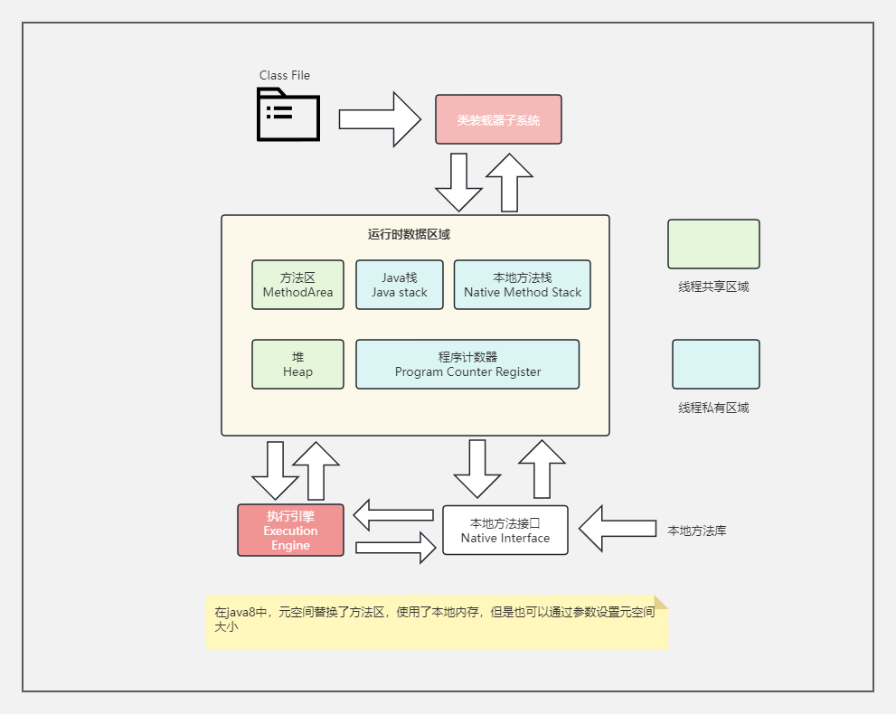
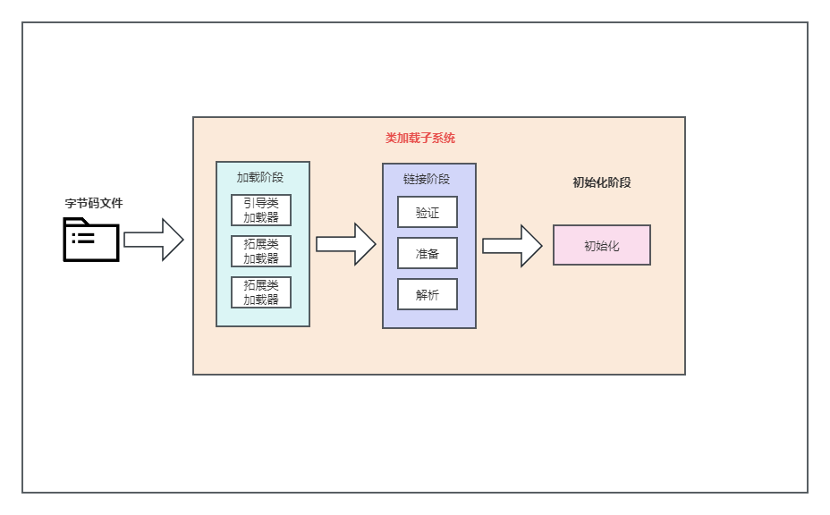

# jvm-demo

## JVM介绍
### JVM 整体结构

### jvm的架构模型

Java编译器输入的指令流基本上是一种基于栈的指令集架构，另一种指令集架构则是基于寄存器的指令集架构。

基于栈式架构的特点：
1. 设计和实现更简单，适用于资源受限的系统；

2. 避开了寄存器的分配难题：使用零地址指令方式分配；

3. 指令流中的指令大部分是零地址指令，其执行过程依赖于操作栈。指令集更小，编译器容易实现

4. 不需要硬件支持，可移植性更好，更好实现跨平台

基于寄存器架构的特点：

1. 典型的应用是x86的二进制指令集：比如传统的PC一级Android的Davlik虚拟机。

2. 指令集架构完全依赖硬件，可移植性差

3. 性能优秀和更高的执行效率

4. 花费更少的指令去完成一项操作。

5. 在大部分情况下，基于寄存器架构的指令往往都以一地址指令、二地址指令和三地址指令为主，而基于栈式
架构的指令集确是以零地址指令为主
   
## 类加载器子系统

类加载过程：

### 加载阶段（加载字节码文件）

1. 通过一个类的全限定名获取定义此类的二进制字节流。

2. 将这个字节流所代表的的静态存储结构转化为方法区的运行时数据结构。

3. 在内存中生成一个代表这个类的java.lang.Class对象，作为方法区中这个类的各种数据的访问入口。

JVM规范中并没有规定字节码文件从何处加载

### 链接阶段

链接阶段分为三个步骤：验证、准备、解析

#### 验证（Verify）

1. 目的在于确保Class文件的字节流中包含信息符合当前虚拟机要求，保证被加载类的正确性,不会危害虚拟机自身安全.

2. 主要包括四种验证：文件格式验证，元数据验证，字节码验证，符号引用验证 。

#### 准备（Prepare）

1. 为类变量分配内存并且设置该类变量的默认初始值，即零值

2. 这里不包含用final修饰的static，因为final在编译的时候就会分配了，准备阶段会显式初始化。

3. 这里不会为实例变量分配初始化，类变量会分配在方法区中，而实例变量是会随着对象一起分配到Java堆中。

#### 解析（Resolve）

1. 将常量池内的符号引用转换为直接引用的过程。

2. 事实上，解析操作往往会伴随着JVM在执行完初始化之后再执行。

3. 符号引用就是一组符号来描述所引用的目标。符号引用的字面量形式明确定义在《java虚拟机规范》的Class文件格式中。直接引用就是直接指向目标的指针、相对偏移量或一个间接定位到目标的句柄。

4. 解析动作主要针对类或接口、字段、类方法、接口方法、方法类型等。对应常量池中CONSTANT_Class_info、CONSTANT_Fieldref_info、CONSTANT_Methodref_info等。

#### 初始化（Initialization）